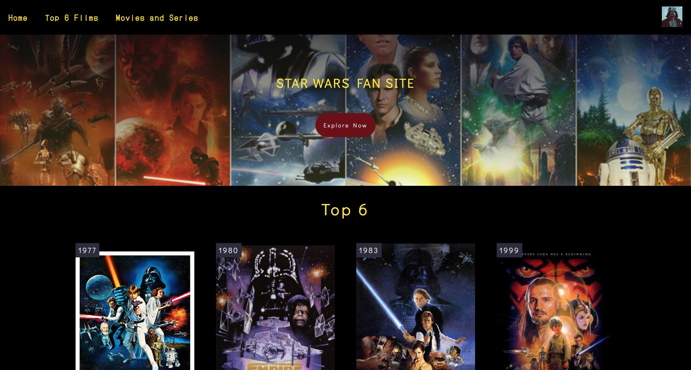

<h1 align="center">🌟 Star Wars Fan Site 🌟</h1>

<p align="center">
    
    
    
    
    <a href="https://github.com/angelawong3"></a>
</p>

### Overview

```
An advanced css website.
```

### Screenshot


User Interface

### Technologies used

1. HTML
2. CSS
3. Google Fonts

### Link:

Click [https://angelawong3.github.io/starwars-fansite/](https://angelawong3.github.io/starwars-fansite/) to go to the page.

### License

[](https://opensource.org/licenses/MIT)

### Contact Me

Please contact me at angelawong3@yahoo.com

---

© 2022 Angela Wong
